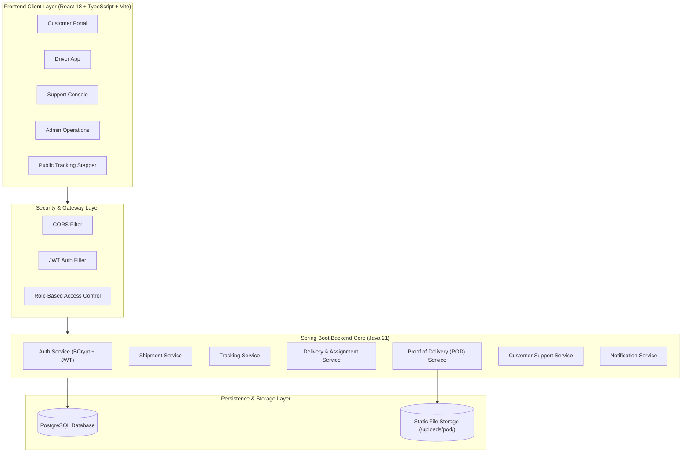

<div align="center">

```
   _____ _     _吨 _____                _      _____            
  / ____| |   (_) |__   __|              | |    |  __ \           
 | (___ | |__  _ _ __ | |_ __ __ _  ___| | __ | |__) | __ ___   
  \___ \| '_ \| | '_ \| | '__/ _` |/ __| |/ / |  ___/ '__/ _ \  
  ____) | | | | | |_) | | | | (_| | (__|   <  | |   | | | (_) | 
 |_____/|_| |_|_| .__/|_|_|  \__,_|\___|_|\_\ |_|   |_|  \___/  
                | |                                             
                |_|   B 2 C   L O G I S T I C S   P L A T F O R M 
```

# ShipTrack Pro

### *Next-Generation B2C Parcel Delivery, Real-Time Fleet Tracking & Proof-of-Delivery Platform*

[](https://github.com/loharaniket/ShipTrack-Pro)
[](https://www.oracle.com/java/)
[](https://spring.io/projects/spring-boot)
[](https://www.typescriptlang.org/)
[](https://react.dev/)
[](https://www.postgresql.org/)
[](https://vitejs.dev/)
[](LICENSE)
[](https://github.com/loharaniket/ShipTrack-Pro/pulls)

<p align="center">
  <a href="#-overview">Overview</a> •
  <a href="#-key-features">Key Features</a> •
  <a href="#-architecture">Architecture</a> •
  <a href="#-delivery-workflow">Delivery Workflow</a> •
  <a href="#-role-based-modules">Role Modules</a> •
  <a href="#-getting-started">Getting Started</a> •
  <a href="#-api-documentation">API Specs</a> •
  <a href="#-license">License</a>
</p>

---

</div>

## 🌐 Overview

**ShipTrack Pro** is a modern, enterprise-grade B2C logistics shipment management ecosystem designed to bridge the operational divide between **Customers**, **Courier Drivers**, **Customer Support Agents**, and **Platform Administrators**.

Built on a robust **Spring Boot (Java 21)** REST core and a reactive **React 18 + TypeScript** web application, ShipTrack Pro handles the full parcel lifecycle—from initial booking and automated sequence generation (`STP10001+`), to dispatch allocation, real-time milestone transitions, photographic Proof of Delivery (POD) capture, and complaint ticket resolution.

```
       +-------------------------------------------------------------+
       |                        ShipTrack Pro                        |
       |             End-to-End B2C Logistics Operations             |
       +-------------------------------------------------------------+
                                      |
         +-----------------+----------+----------+-----------------+
         |                 |                     |                 |
         v                 v                     v                 v
   [ 📦 Customer ]   [ 🚚 Courier ]       [ 🎧 Support ]     [ ⚙️ Admin ]
   • Book Shipment   • Route Queue         • Ticket Triage   • Dispatch Queue
   • Public Track    • Status Updates      • Investigation   • Driver Fleet
   • POD Photo View  • Photo POD Upload    • Issue Resolve   • System Reports
```

---

## ⚡ Why Choose ShipTrack Pro?

| Capability | Legacy Courier Portals | ShipTrack Pro Platform |
| :--- | :--- | :--- |
| **User Roles** | Siloed, disconnected single-role interfaces | Unified multi-role RBAC (*Customer, Driver, Support, Admin*) |
| **Tracking Experience** | Static text updates with delayed batch sync | Live visual 6-stage milestone tracker with public timeline access |
| **Proof of Delivery** | Paper slips prone to damage and loss | Digital multi-part upload with photo verification & recipient validation |
| **Dispatch Automation** | Manual phone calls / external spreadsheets | Real-time pending allocation queue with one-click courier assignment |
| **Issue Resolution** | Detached email ticketing | Direct shipment-linked support tickets with agent resolution actions |
| **Real-Time Alerts** | No instant notifications | In-app notification bell with unread badges & auto-polling |

---

## 🚀 Key Features

### 📦 Customer Self-Service Portal
- **Streamlined Booking**: Instant flat-schema booking with automatic sequence generation (`STP10001+`).
- **Interactive Public Tracking**: 6-stage visual milestone stepper (`CREATED` → `ASSIGNED` → `PICKED_UP` → `IN_TRANSIT` → `OUT_FOR_DELIVERY` → `DELIVERED`).
- **Proof of Delivery (POD) Inspection**: High-resolution delivery photo and recipient signature preview for completed orders.
- **Integrated Complaints**: Raise support tickets directly linked to specific tracking numbers.

### 🚚 Courier Driver Mobile/Web Workflow
- **Assigned Deliveries Queue**: Live roster of parcels assigned by dispatch.
- **Workflow State Engine**: Milestone advancements with custom transit notes and location tags.
- **Photo POD Capture**: Multipart upload for camera capture / image signatures ($\le 5\text{MB}$, JPEG/PNG/WebP validation) that atomically finalizes delivery.

### 🎧 Customer Support Agent Console
- **Centralized Ticket Management**: Live status filters (`OPEN`, `IN_PROGRESS`, `RESOLVED`, `CLOSED`) and multi-attribute search.
- **Linked Shipment Telemetry**: Instant inspection of recipient details, delivery route, and chronological audit logs.
- **Resolution Workflow**: One-click status transitions and resolution messaging.

### ⚙️ Administrator Supervision & Control Center
- **Executive Operations Dashboard**: Real-time KPI cards (*Total Booked, Pending Dispatch, In-Transit, Delivered, Open Complaints, Active Couriers*).
- **Pending Dispatch Allocation Queue**: Immediate detection of `CREATED` shipments with modal driver assignment.
- **Driver Fleet & User Management**: Role-based access control, account status supervision, and user auditing.
- **Throughput Analytics**: Visual status breakdown distributions and ticket resolution metrics.

---

## 🏗️ Architecture



---

## 🔄 Delivery Workflow Lifecycle

```
 +-----------------------------------------------------------------------------------+
 |                             Shipment Lifecycle State Machine                      |
 +-----------------------------------------------------------------------------------+
 
    [ CUSTOMER ]                                   [ ADMINISTRATOR ]
  Book Shipment                                      Assign Driver
        |                                                 |
        v                                                 v
   ( CREATED ) ------------------------------------> ( ASSIGNED )
                                                          |
                                                          |  [ COURIER DRIVER ]
                                                          |  Pick up package
                                                          v
                                                    ( PICKED_UP )
                                                          |
                                                          |  [ COURIER DRIVER ]
                                                          |  Transit between hubs
                                                          v
                                                   ( IN_TRANSIT )
                                                          |
                                                          |  [ COURIER DRIVER ]
                                                          |  Out on route
                                                          v
                                                ( OUT_FOR_DELIVERY )
                                                          |
                                                          |  [ COURIER DRIVER ]
                                                          |  Upload Photo POD
                                                          v
                                                   ( DELIVERED ) ✅
```

---

## 👥 Role-Based Modules & Endpoints

```
 ┌─────────────────┬────────────────────────────────────────────────────────────────────────┐
 │ Role            │ Accessible Modules & Core Capabilities                                 │
 ├─────────────────┼────────────────────────────────────────────────────────────────────────┤
 │ 👤 Customer     │ • Dashboard & KPI metrics                                              │
 │                 │ • Book Shipment (POST /api/customer/shipments)                         │
 │                 │ • My Shipments List & Details (GET /api/customer/shipments)            │
 │                 │ • Public Timeline (GET /api/tracking/{trackingNumber})                 │
 │                 │ • View Delivered POD (GET /api/customer/shipments/{id}/pod)            │
 │                 │ • Raise & View Support Tickets (GET/POST /api/customer/tickets)        │
 ├─────────────────┼────────────────────────────────────────────────────────────────────────┤
 │ 🚚 Driver       │ • Courier Dashboard & Active Deliveries Queue                          │
 │                 │ • Assigned Deliveries (GET /api/operator/deliveries)                   │
 │                 │ • Milestone Status Updates (PUT /api/operator/shipments/{id}/status)   │
 │                 │ • Upload Photo POD (POST /api/operator/pod)                            │
 ├─────────────────┼────────────────────────────────────────────────────────────────────────┤
 │ 🎧 Support Agent│ • Support Console & Issue Priority Queue                               │
 │                 │ • Ticket Management (GET /api/support/tickets)                         │
 │                 │ • Ticket Details & Linked Shipments (GET /api/support/tickets/{id})   │
 │                 │ • Update Resolution Status (PUT /api/support/tickets/{id})             │
 ├─────────────────┼────────────────────────────────────────────────────────────────────────┤
 │ ⚙️ Administrator │ • Admin Operations Portal (GET /api/admin/dashboard/stats)             │
 │                 │ • Pending Dispatch Queue (GET /api/admin/shipments/pending)            │
 │                 │ • Assign Courier Driver (POST /api/admin/assignments)                  │
 │                 │ • Driver Fleet Roster (GET /api/admin/drivers)                         │
 │                 │ • User Management & Filtering (GET /api/admin/users)                   │
 │                 │ • Operational Breakdown Reports (GET /api/admin/reports)               │
 └─────────────────┴────────────────────────────────────────────────────────────────────────┘
```

---

## 🛠️ Tech Stack & Language Tags

<div align="center">

| Technology | Layer | Purpose |
| :--- | :--- | :--- |
|  | Backend | High-performance compiled backend runtime |
|  | Backend | Enterprise REST API, JPA Data, & Security framework |
|  | Security | JWT Stateless Auth, BCrypt password hashing & RBAC |
|  | Database | Relational database with sequence generation |
|  | Frontend | Strongly-typed client application logic |
|  | Frontend | Declarative component UI library |
|  | Build Tool | Next-generation fast frontend bundler & dev server |
|  | UI Assets | Clean, accessible iconography |

</div>

---

## 🚦 Getting Started

### Prerequisites

Ensure you have the following installed on your machine:
- **Java Development Kit (JDK)** 17 or 21+ (`java -version`)
- **Apache Maven** 3.9+ (`mvn -v`)
- **Node.js** 18+ & **npm** 9+ (`node -v`, `npm -v`)
- **PostgreSQL** 15+ running locally or in Docker

---

### 1. Database Initialization

Create a PostgreSQL database for the platform:

```sql
CREATE DATABASE shiptrack;
```

---

### 2. Backend Setup & Startup

1. Navigate to the backend directory:
   ```bash
   cd backend
   ```

2. Configure your database credentials in `src/main/resources/application.yml`:
   ```yaml
   spring:
     datasource:
       url: jdbc:postgresql://localhost:5432/shiptrack
       username: postgres
       password: password
   ```

3. Run automated tests to verify stability:
   ```bash
   mvn clean test
   ```

4. Launch the Spring Boot application:
   ```bash
   mvn spring-boot:run
   ```
   *The backend server will start on `http://localhost:8080`.*

---

### 3. Frontend Setup & Startup

1. In a new terminal window, navigate to the frontend directory:
   ```bash
   cd frontend
   ```

2. Install dependencies:
   ```bash
   npm install
   ```

3. Start the Vite development server:
   ```bash
   npm run dev
   ```
   *The web application will launch on `http://localhost:3000` (or `http://localhost:5173`).*

---

## 🔑 Default Test Credentials

The database seeds default accounts covering each role out-of-the-box:

| Role | Email Address | Password | Permissions |
| :--- | :--- | :--- | :--- |
| **👑 Administrator** | `admin@shiptrack.com` | `admin123` | Full dispatch, driver assignment, user management & reports |
| **🚚 Courier Driver** | `driver1@shiptrack.com` | `driver123` | View assigned route, progress milestones, upload photo POD |
| **🎧 Support Agent** | `support@shiptrack.com` | `support123` | View customer tickets, update resolution status, link shipments |
| **📦 Customer** | `customer@example.com` | `customer123` | Book shipments, track packages, inspect POD, raise tickets |

---

## 📡 API Specification Summary

### Authentication Endpoints
```http
POST /api/auth/register          - Register new user (Default: CUSTOMER)
POST /api/auth/login             - Authenticate user & issue JWT accessToken + refreshToken
POST /api/auth/refresh           - Transparently refresh expired JWT access token
GET  /api/auth/profile           - Retrieve authenticated user profile & roles
```

### Customer Endpoints
```http
POST /api/customer/shipments      - Book a new shipment (Returns generated trackingNumber)
GET  /api/customer/shipments      - Fetch all shipments belonging to authenticated customer
GET  /api/customer/shipments/{id} - Fetch full shipment details and milestone timeline
GET  /api/customer/shipments/{id}/pod - View delivery photo and recipient signature
POST /api/customer/tickets        - Submit a new support complaint / ticket
GET  /api/customer/tickets        - List support tickets submitted by customer
GET  /api/customer/tickets/{id}   - View support ticket status and resolution notes
```

### Operator (Courier Driver) Endpoints
```http
GET  /api/operator/deliveries            - List all deliveries assigned to logged-in courier
PUT  /api/operator/shipments/{id}/status - Progress status (PICKED_UP, IN_TRANSIT, OUT_FOR_DELIVERY)
POST /api/operator/pod                   - Upload Proof of Delivery (Multipart: shipmentId, receiverName, photo)
```

### Support Agent Endpoints
```http
GET  /api/support/tickets        - List all tickets with optional ?status= filter
GET  /api/support/tickets/{id}   - Inspect full ticket details & customer history
PUT  /api/support/tickets/{id}   - Update ticket status (OPEN, IN_PROGRESS, RESOLVED, CLOSED)
```

### Administrator Endpoints
```http
GET  /api/admin/dashboard/stats    - Live platform stats (Total, Pending, In-Transit, Delivered, Open Tickets)
GET  /api/admin/shipments/pending  - List shipments in CREATED status requiring dispatch
POST /api/admin/assignments        - Assign active courier driver to shipment
GET  /api/admin/drivers            - List active driver fleet roster
GET  /api/admin/users              - List system accounts with role filters (?role=DRIVER, etc.)
GET  /api/admin/reports            - Operational status distributions & resolution breakdowns
```

### Public Tracking Endpoint (No Auth Required)
```http
GET  /api/tracking/{trackingNumber} - Public milestone stepper and event history
```

---

## 🧪 Testing & Verification

### Automated Backend Tests
Run the complete unit, repository, service, and end-to-end integration test suite:

```bash
cd backend
mvn clean test
```
*Expected: 43/43 tests passing with 0 errors.*

### Production Frontend Build
Validate TypeScript types, JSX compilation, and build optimization:

```bash
cd frontend
npm run build
```
*Expected: Vite production bundle built with 0 errors.*

---

## 🤝 Contributing

Contributions make the open-source community an amazing place to learn, inspire, and create. Any contributions you make are **greatly appreciated**.

1. Fork the Project (`https://github.com/loharaniket/ShipTrack-Pro/fork`)
2. Create your Feature Branch (`git checkout -b feat/AmazingFeature`)
3. Commit your Changes (`git commit -m 'feat: Add some AmazingFeature'`)
4. Push to the Branch (`git push origin feat/AmazingFeature`)
5. Open a Pull Request

---

## 📄 License

Distributed under the **Apache 2.0 License**. See [`LICENSE`](LICENSE) for more information.

---

<div align="center">

Made with ❤️ by the **Aniket Lohar**

[⭐ Star this repository on GitHub](https://github.com/loharaniket/ShipTrack-Pro)

</div>
